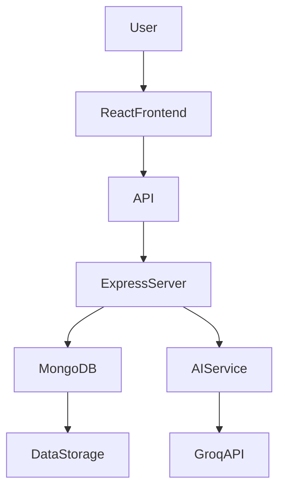
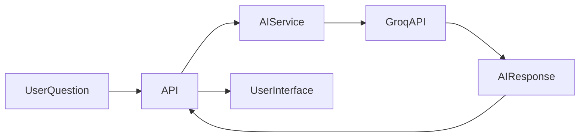

# 🚀 FinPilot AI

### AI-Powered Personal Finance Tracker & Smart Budget Assistant


FinPilot AI is a **modern AI-powered personal finance management platform** that helps users track expenses, analyze spending patterns, and receive intelligent financial insights.

The system includes an **AI assistant**, **budget recommendations**, **analytics dashboards**, and **expense predictions** to help users manage their finances smarter.

---

# ✨ Key Features

### 💰 Expense & Transaction Management

* Add, update, delete transactions
* Categorize expenses & income
* Track financial activity easily

### 📊 Financial Analytics

* Spending visualization
* Category-wise breakdown
* Monthly insights

### 🤖 AI Finance Assistant

* Ask finance-related questions
* AI suggests spending improvements
* Smart financial guidance

### 📉 Budget Recommendation

* AI suggests ideal monthly budgets
* Helps users avoid overspending

### 🔮 Expense Prediction

* Predicts next month expenses
* Uses historical transaction data

### 📑 Financial Reports

* Income vs expense summary
* Monthly financial reports

### 🔐 Secure Authentication

* JWT-based login system
* Protected routes & APIs

---

# 🛠 Tech Stack

### Frontend

* React.js
* Vite
* CSS

### Backend

* Node.js
* Express.js

### Database

* MongoDB

### AI Integration

* Groq API

### Authentication

* JWT (JSON Web Token)

---

# 🏗 Project Architecture



### Architecture Explanation

1. **React Frontend**

   * Handles UI and user interaction

2. **Node.js + Express Backend**

   * Processes API requests
   * Handles authentication
   * Manages business logic

3. **MongoDB**

   * Stores users, transactions, budgets, reports

4. **AI Integration**

   * Groq API processes financial questions
   * Provides budgeting and financial suggestions

---

# 🤖 AI Workflow



### Example AI Queries

Users can ask:

* “How can I reduce my monthly expenses?”
* “Predict my next month spending”
* “Suggest a better budget plan”

The AI analyzes financial data and returns intelligent suggestions.

---

# 📂 Project Structure

```
FinPilot-AI
│
├── expense-tracker-frontend
│   ├── src
│   ├── components
│   ├── pages
│   └── vite.config.js
│
├── expense-tracker-backend
│   ├── controllers
│   ├── models
│   ├── routes
│   └── server.js
│
└── README.md
```

---

# 🚀 Installation

## 1️⃣ Clone Repository

```
git clone https://github.com/raghuram-007/FinPilot-AI.git
cd FinPilot-AI
```

---

## 2️⃣ Backend Setup

```
cd expense-tracker-backend
npm install
```

Create `.env`

```
PORT=5000
MONGO_URI=your_mongodb_connection
JWT_SECRET=your_secret_key
GROQ_API_KEY=your_api_key
```

Run backend

```
npm start
```

---

## 3️⃣ Frontend Setup

```
cd expense-tracker-frontend
npm install
npm run dev
```

---

# 🎯 Future Improvements

* AI financial goal planner
* Investment suggestions
* Email alerts for spending limits
* Mobile responsive UI
* Export reports (PDF/CSV)

---

# 👨‍💻 Author

**Raghuram S**

Full Stack Developer

GitHub
https://github.com/raghuram-007

---

# ⭐ Support

If you like this project, please consider giving it a **star ⭐ on GitHub**.
